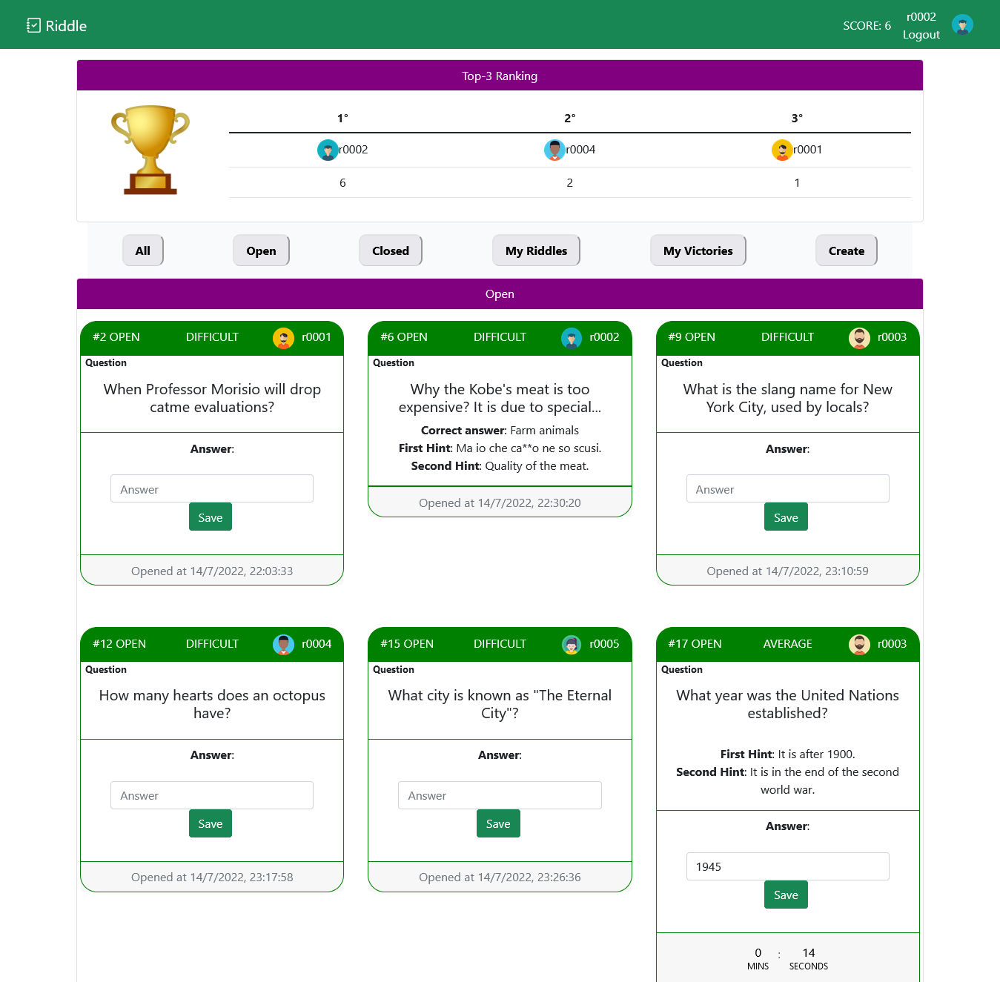

# Exam #2: "SolveMyRiddle"
## Student: s303369 Singh Simran

## React Client Application Routes

- Route `/`: it is the parent route and it renders the outlet component containing the navbar and the toast container in the nested routes. 
At the same URL in the parent outlet is rendered the `index route` which represents the HomePage of the application containing all the riddles.
- Route `/CreateRiddle`: it displays the form in order to create a new riddle. 
- Route `/Login`: it displays the login form.

## API Server

- POST `/api/sessions`
  |Request body content | Request parameter | Responses | Response body content |
  | ----------- | ----------- |----------- |----------- |
  | **id** of the student and **password** | |  **403 Forbidden**: client does not have proper authorization to access the requested content. ||
  | | | **500 Internal Server Error**||
  | | | **201 Success**||
- DELETE `/api/sessions/current`
  |Request body content | Request parameter | Responses |Response body content |
  | ----------- | ----------- |----------- |----------- |
  | | | **500 Internal Server Error**  ||
  | | | **204 No Content** success||

- GET `/api/sessions/current`
  |Request body content | Request parameter | Responses |Response body content |
  | ----------- | ----------- |----------- |----------- |
  | | | **401 Unauthorized**  | 'Not authenticated' |
  | | | **500 Internal Server Error** error||
  | | | **200 Success**  | a JSON object with user info e.g.   {id:"r0001", name: "Fabio" , surname: "Stani", mail: "r0001@studenti.polito.it", score: 3}  |

- GET `/api/riddles`
  |Request body content | Request parameter | Responses |Response body content |
  | ----------- | ----------- |----------- |----------- |
  | |  | **500 Internal Server Error** error|
  | | |**200 Success**  | a JSON object with riddles |

- POST `/api/riddle/:id`
  |Request body content | Request parameter | Responses |Response body content |
  | ----------- | ----------- |----------- |----------- |
  | a json object containing   the properties of the new riddle to be saved   `{difficulty,question,` `duration,answer,firstHint,secondHint,userIDAuthor}`| **id** that corresponds to the user id | **401 Unauthorized**  | 'Not Authorized' |
  | a json object containing the properties of the new riddle to be saved | **id** that corresponds to the user id | **500 Internal Server Error** error|
  |  a json object containing   the properties of the new riddle to be saved   `{difficulty,question,` `duration,answer,firstHint,secondHint,userIDAuthor}` | **id** that corresponds to the user id | **422 Unprocessable** user id not valid|'Unprocessable Entity'|
  |  a json object containing   the properties of the new riddle to be saved   `{difficulty,` `duration,answer,firstHint,secondHint,userIDAuthor}` | **id** that corresponds to the user id | **422 Unprocessable** if there is a missing parameter |'Missing parameters'|
  |  a json object containing   the properties of the new riddle to be saved   `{difficulty,question` `duration,answer,firstHint,secondHint,userIDAuthor}` | **id** that corresponds to the user id | **422 Unprocessable** if there is a an invalid question such as an empty string |'invalid question'|
  |  a json object containing   the properties of the new riddle to be saved   `{difficulty,question` `duration,answer,firstHint,secondHint,userIDAuthor}` | **id** that corresponds to the user id | **422 Unprocessable** if there is a an invalid answer such as an empty string |'invalid answer'|
  |  a json object containing   the properties of the new riddle to be saved   `{difficulty,question` `duration,answer,firstHint,secondHint,userIDAuthor}` | **id** that corresponds to the user id | **422 Unprocessable** if there is a an invalid hint such as an empty string |'invalid hint'|
  |  a json object containing   the properties of the new riddle to be saved   `{difficulty,question` `duration,answer,firstHint,secondHint,userIDAuthor}` | **id** that corresponds to the user id | **422 Unprocessable** if the duration is not a number or its value is greater than 600 or less than 30 |'invalid duration'|
  |  a json object containing   the properties of the new riddle to be saved   `{difficulty,question` `duration,answer,firstHint,secondHint,userIDAuthor}` | **id** that corresponds to the user id | **422 Unprocessable** if the difficulty level is not "EASY" nor "AVERAGE" neither "DIFFICULT" |'invalid difficulty'|
  |  a json object containing   the properties of the new riddle to be saved   `{difficulty,question` `duration,answer,firstHint,secondHint,userIDAuthor}` | **id** that corresponds to the user id | **201 Success** if the riddle is created successfully ||

- POST `/api/:id/riddle/:riddleid/answer`
  |Request body content | Request parameter | Responses |Response body content |
  | ----------- | ----------- |----------- |----------- |
  | a json object containing   the new answer to be saved   `{riddleID,answer}`| **id** that corresponds to the user id   **riddleid** corresponding to the id of the riddle| **401 Unauthorized**  | 'Not Authorized' |
  | a json object containing   the new answer to be saved   `{riddleID,answer}`| **id** that corresponds to the user id   **riddleid** corresponding to the id of the riddle | **500 Internal Server Error** error|
  |  a json object containing   the new answer to be saved   `{riddleID,answer}`| **id** that corresponds to the user id   **riddleid** corresponding to the id of the riddle | **422 Unprocessable** user id not valid or riddleid not valid|'Unprocessable Entity'|
  | a json object containing   the new answer to be saved   `{riddleID,answer}`| **id** that corresponds to the user id   **riddleid** corresponding to the id of the riddle  | **422 Unprocessable** if there is a missing parameter |'Missing parameters'|
  |  a json object containing   the new answer to be saved   `{riddleID,answer}`| **id** that corresponds to the user id   **riddleid** corresponding to the id of the riddle  | **422 Unprocessable** if there is a an invalid answer such as an empty string |'invalid answer'|
  |  a json object containing   the new answer to be saved   `{riddleID,answer}`| **id** that corresponds to the user id   **riddleid** corresponding to the id of the riddle | **422 Unprocessable** if there is the riddleID is not a number |'invalid riddleID'|
  |   a json object containing   the new answer to be saved   `{riddleID,answer}`| **id** that corresponds to the user id   **riddleid** corresponding to the id of the riddle | **201 Success** if the answer is created successfully ||

- GET `/api/riddles/ranking`
  |Request body content | Request parameter | Responses |Response body content |
  | ----------- | ----------- |----------- |----------- |
  | |  | **500 Internal Server Error** error|
    | | |**404 Not Found**  if the ranking is not found | "Ranking not Found"  |
  | | |**200 Success**  | a JSON object with ranking  |

## Database Tables

- Table `USERS` - contains: `id,name,surname, mail, password, salt, score`  It contains user's info.
- Table `RIDDLE` - contains: `difficulty,question,duration,answer,firstHint,secondHint,openingTime,closureTime,userIDAuthor, winnerUserID,state`  It contains all the riddles
- Table `ANSWER` - contains: `riddleID,userID,time,correct,answer`  It contains all the answers given to a riddle identified by the riddleID

## Main React Components

- `HomePage` (`RiddleViews.js`): it just displays all the riddles.
    - the ranking of the top-3 users is shown by the component `RiddleRanking` in (`Ranking.js`).
    - The `ButtonBar` in (`ButtonBar.js`) contains some buttons in order to filter the riddles.
    - The grid is created by `RiddleGrid` (in `RiddleGrid.js`) used for displaying the riddles. Each row contains a different number of cards according to the size of the window and each riddle is rendered by `RiddleData` (in `RiddleData.js`).
- `CreateRiddle`(`RiddleViews.js`) is the component that renders the form to create a new riddle. The form is created by `CreateRiddleForm` (in `CreateRiddle.js`).

## Screenshot

## Users Credentials
  | StudentId | password  |
  | ----------- | ----------- |
  | r0001    |   password | 
  | r0002   |   password | 
  | r0003   |   password | 
  | r0004   |   password | 
  | r0005   |   password | 

  